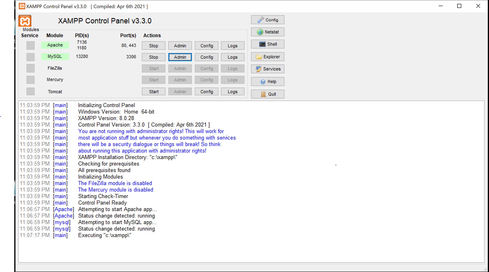
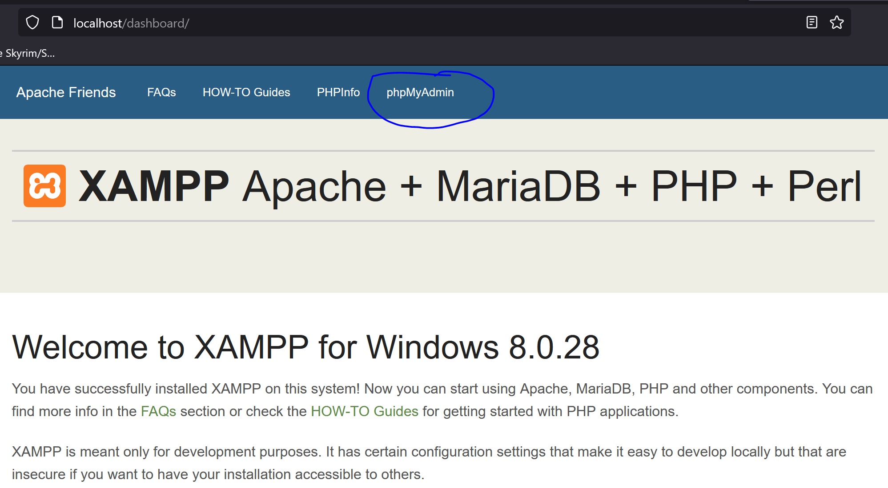
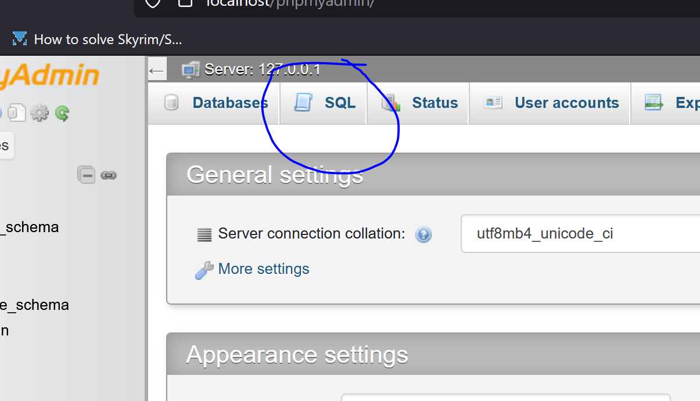
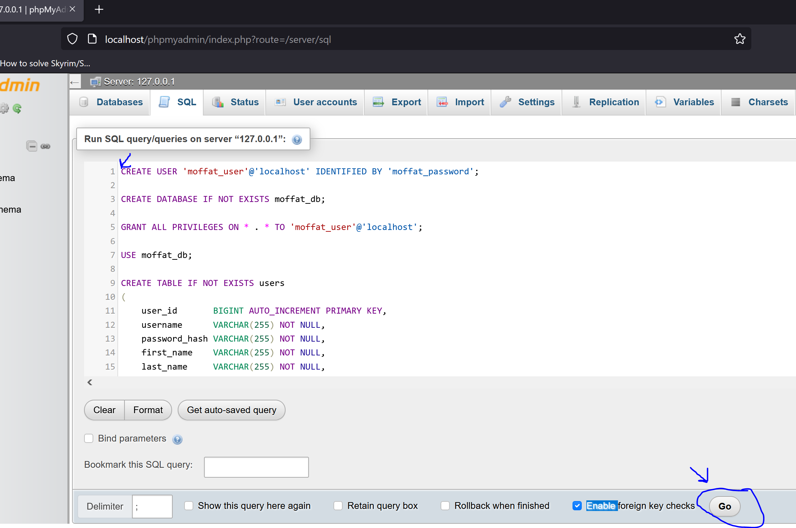
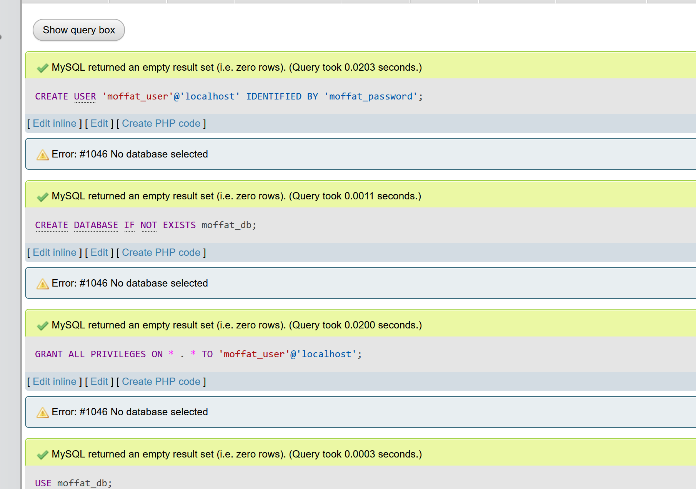
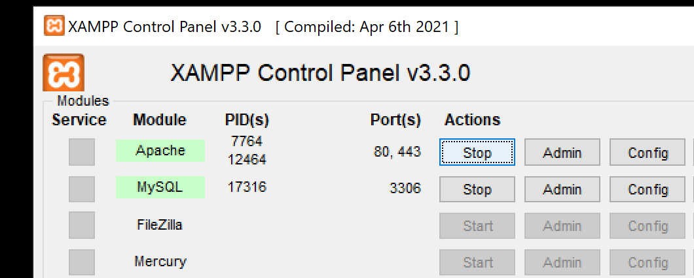
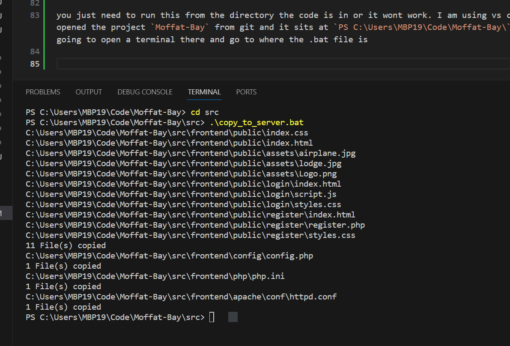
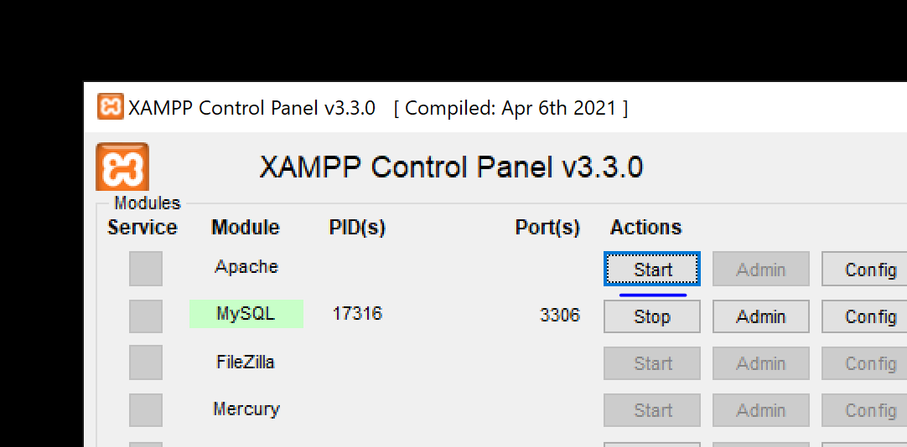
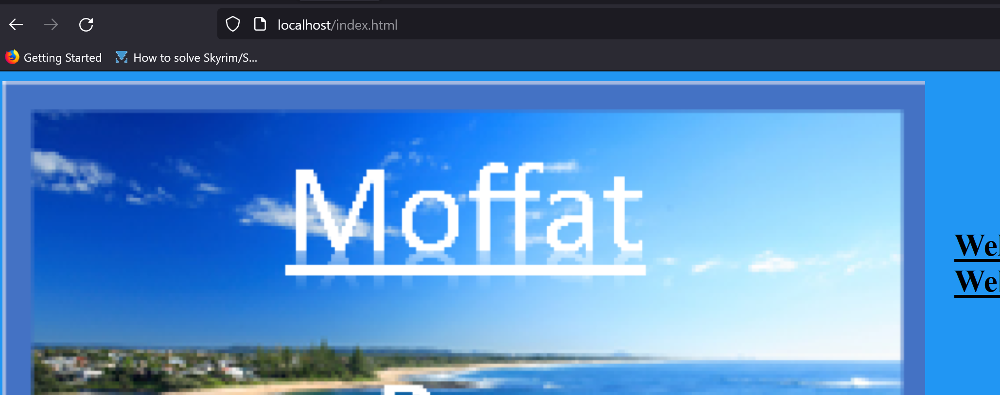

# Moffat-Bay
Capstone in Software Development 

## Windows Setup

> please correct this with whatever we are using

### 1. Install XAMPP
I downloaded x86_64 windows XAMPP server from https://www.apachefriends.org/download.html and ran the wizard. I did keep the default myPHPAdmin installation so I could interact with the MySQL database via GUI

### 2. Start XAMPP

a. start Apache and MySQL from the XAMPP control panel



### 3. Initialize Database with .sql script
we have that [sql script that reflects the ERD](https://github.com/justhowe/Moffat-Bay/blob/main/src/database/init.sql) submitted in module 4. It should set up most of what we need and not require other one off scripts.

a. with myphpadmin installed and the server started, open a browser and navigate to http://localhost and open myphpadmin



from there you just need to execute the sql script against the database. It is important that we either use this script, or something else in the repository as it dictates our database connection credentials and will break our application if we do not all use the same database, configuration, and code. 

b. open sql console



c. paste and execute the sql script



d. see success messages

the console should send back something like this on success




### 4. Import the Project into the XAMPP server
after looking at the layout and use of certain files in the XAMPP filesystem, I think we should focus on 
synchronizing our environment with each other. The files mentioned here are a part of the project and will be committed to Git so we can keep track of them. Here are the important parts imo
(these arent steps just explaining the files im talking about)

the web content served to the user (html, css, php) from the XAMPP document root is in

```
frontend\public -> C:\xampp\htdocs\
```

the configuration of constants like our database credentials should be excluded from user facing content
but still accessable to the PHP runtime 

```
frontend\config\config.php -> C:\xampp\config\config.php
```

the `php.ini` will let us change things like add extensions and set language level for XAMPP
```
frontend\php\php.ini -> C:\xampp\php\php.ini
```

the `httpd.conf` lets us change things about apache like where the document root is and what can be served in a web request and who has permission to it
```
frontend\apache\conf\httpd.conf -> C:\xampp\apache\conf\httpd.conf
```

we should not have to manually copy any of this over, that is something I will definitely mess up. We can use this windows batch (`.bat`) file to just do that for us. Here is the steps I would take to do that:

1. edit and code that I need for moffat bay like html, css, php etc that is in `frontend\public` and remember to save.
2. stop apache in the XAMPP control panel



3. open a terminal and run the `copy_to_server.bat` batch file

- [howto open terminal eclipse](https://code2care.org/howto/how-to-access-terminal-in-eclipse-ide/)
- [howto open terminal vscode](https://code.visualstudio.com/docs/terminal/basics)
- [howto open terminal intellij](https://www.jetbrains.com/help/idea/terminal-emulator.html)
- open a regular old windows terminal `Windows button then type CMD`

you just need to run this from the directory the code is in or it wont work. I am using vs code here and I opened the project `Moffat-Bay` from git and it sits at `PS C:\Users\MBP19\Code\Moffat-Bay\` for me. I am going to open a terminal there and go to where the .bat file is with the change directory command `cd` and run the batch file



4. now the code should have been copied to the XAMPP server as well as the configuration files we talked about, now we should just start the server



5. now we just go to http://localhost/index.php in our browser and view the code change




## Lessons Learned

- remember to use `require_once` instead of `include` when the same dependency will be used in multiple places
- the function `session_start()` will create a new session only if one does not exist, but reuse if one does exist
- you can pass values around the application like a context object with [PHP Superglobals](https://www.php.net/manual/en/language.variables.superglobals.php)
- if you separate your web content into something like this:
```
    app
     |--index.php     # the keyword is index
     |--login
         |--index.php
         |--login.php
         |--style.css
```
then we will have a clean url like a real website https://some-website/login 