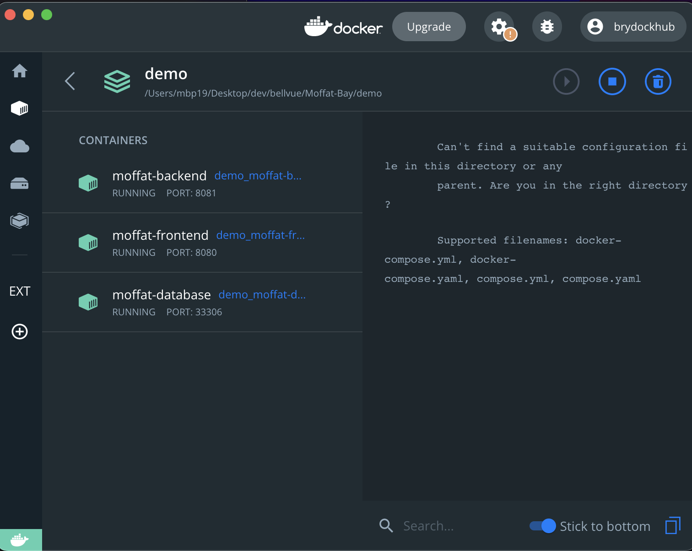
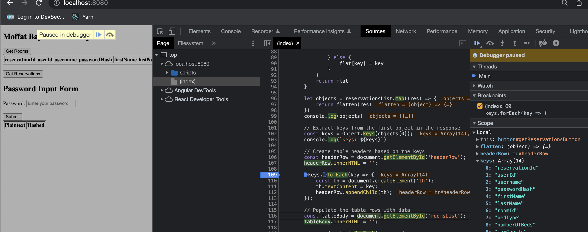
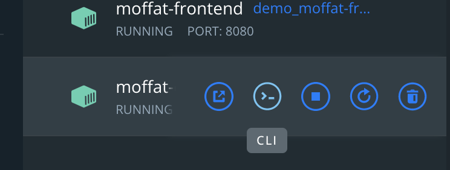
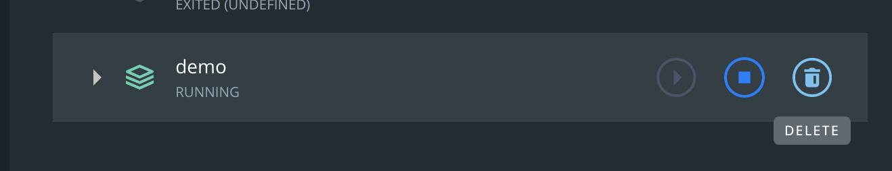

# Demo

## Overview

This is just to demonstrate what it would look like to design the moffat bay system with a Representational state transfer API as the backend and not
something that needs to render HTML on the server side

this Demo uses docker to build and run the Demo which is a lot but I think it will allow us to move faster in the
end. On all of our dev machines, (works on windows, mac, linux) we would need to install [Docker Desktop](https://www.docker.com/products/docker-desktop/) 




## Build and run the Demo

> if youre on windows you might have to make a change to your git config (thanks @drabynoops)
```shell
git config --global core.autocrlf input
```

1. open a terminal either CMD on windows or Terminal on mac to and use `docker compose` ([included with Docker Desktop](https://docs.docker.com/compose/install/))
```shell
cd your/path/to/Moffat-Bay/demo/   # Mac / Linux

cd C:\your\path\to\Moffat-Bay\demo\  # Windows
```

2. build the container images from source (any OS)
```shell
 docker compose -f moffat-compose.yml build
```
3. run them on your machine
```shell
docker compose -f moffat-compose.yml up -d
```
they should be viewable in Docker Desktop from here, also on mac and linux you can check with
```shell
docker ps -a
```
granted there are no errors up to this point you should be able to navigate in your browser of choice to http://localhost:8080/,
there should be a button there "Get Room Data" which will fetch the data in the demo for rooms. if you're able to do that then 
everything is running fine. 

## Why use MySQL
it is dictated by the course and we are familiar with it so seems like a no-op there

## Why use Spring Boot
spring boot is a framework built by pivotal labs that is designed to give developers the ability to build something
scalable fast but also keep things not super complicated when just getting started. There's a huge community to support it and a lot of users. if
we want to look something up because its blocking us it's probably already been answered on [baeldung](https://www.baeldung.com/) 
somewhere and that will keep us moving. This is going to be a bigger project and we can save a ton of time on not maintaining 
a bunch of boiler plate code in my novice opinion. If we look at the following example I think they are much faster and cleaner than using
Jakarta EE and have clearer separation of concerns instead of having a ton of Swiss army knife JSP pages:
```shell
MoffatBackend/src/main/java/com/csd460/moffat/controllers/RoomController.java
MoffatBackend/src/main/java/com/csd460/moffat/service/RoomService.java
MoffatBackend/src/main/java/com/csd460/moffat/dao/RoomDAO.java
```

This also makes the ability to write tests for the backend much easier than having frontend backend all in one

## Why use plain HTML|JS|CSS for the frontend
We took classes on it so I think it will be something that will be not a huge obstacle for us. Just want to show that passing 
JSON between frontend and backend with these are possible 

What is really helpful about having the client code separate from the server code is that we can use the browsers debugger to test and work through solutions



we can also use the [Web Crypto Api](https://developer.mozilla.org/en-US/docs/Web/API/Web_Crypto_API) to easily hash passwords and is supported by most browsers

## Why use Docker here?
### reasons why its good for our project
1. removes the need for us to install Tomcat or any other Web server on our dev environments
2. removes the need for us to install a database management service on our dev environments
3. hopefully removes some of the "it works on my machine" aspect of software development in a team
4. gives us a more ephemeral database that we can blow away at any time, no need for migrations and no need for managing a MySQL database per user
5. probably the most valuable in this list, allows us to test the entire application end to end without having to
set up mocks for the data access layer
6. the environment that a developer would have would be much more in parity to one that a production environment would have

### reasons why its good for real life
1. container based architecture transfers to service oriented architecture pretty easy
2. is a common method and technology used in the industry today
3. aside from the learning curve around docker, it should make development a little easier

## Troubleshooting

### Connecting to the database

1. open up a shell to the database via Docker Desktop 



2. open up a shell to MySQL. Side note all of these containers will be some sort of linux OS
```shell
mysql -u moffat_user -pmoffat_password -h localhost -P 3306 -D moffat_db
```
then run your query
```mysql
SELECT * FROM rooms;
```

you can also connect from any other application on your dev environment at `mysql://localhost:33306`

### Making requests of the backend

a. in browser, go to http://localhost:8081/api/rooms

b. or curl the endpoint
```shell
curl http://localhost:8081/api/rooms
```

c. or use [Postman](https://www.postman.com/) to set up your requests, it's a good tool

### Getting code changes to reflect in your environment

if you make a change to any of the frontend, backend, or database, all you have to do is rebuild the container images and rerun them with docker compose

1. build the container images from source (any OS)
```shell
 docker compose -f moffat-compose.yml build
```
2. run them on your machine
```shell
docker compose -f moffat-compose.yml up 
```


### Getting rid of the project
if you want to delete the containers it is very easy to manage them in Docker Desktop, just hit the delete button here


